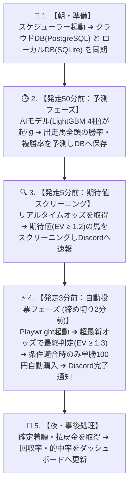

前回の第1号記事では、私が「好きな仕事だけをして自由に暮らす」ことを目指し、プログラミング未経験からChatGPTと一緒に競馬AIを作り始めたストーリーをお話ししました。

今回は予告通り、**現在リアル運用で稼働している「競馬予測AI＆完全自動投票システム」の全体像とシステムアーキテクチャ** について、包み隠さず全貌を公開します！

---

## 🔄 システム全体のパイプライン（エンドツーエンド処理）

このシステムは、朝の起動からレース出馬表の取得、AIモデルによる予測、締め切り直前のリアルタイムオッズ取得・期待値（EV）判定、そして実際のUMACA完全自動投票まで、**すべての工程が全自動で完結** しています。

### 発走50分前〜発走直前のタイムライン



<div className="my-6 space-y-3">
  <div className="flex items-start gap-3 p-3.5 bg-slate-50 rounded-xl border border-slate-200">
    <span className="shrink-0 px-2.5 py-1 text-xs font-bold rounded-lg bg-slate-200 text-slate-700">朝・準備</span>
    <p className="text-xs text-slate-700 leading-relaxed font-medium">スケジューラー起動 ➔ クラウドDB(PostgreSQL) と ローカルDB(SQLite) を同期</p>
  </div>
  <div className="flex items-start gap-3 p-3.5 bg-blue-50/60 rounded-xl border border-blue-200">
    <span className="shrink-0 px-2.5 py-1 text-xs font-bold rounded-lg bg-blue-600 text-white">発走50分前</span>
    <p className="text-xs text-slate-800 leading-relaxed font-medium">AIモデル(LightGBM 4種)起動 ➔ 出走馬全頭の勝率・複勝率を予測しDBへ保存</p>
  </div>
  <div className="flex items-start gap-3 p-3.5 bg-amber-50/60 rounded-xl border border-amber-200">
    <span className="shrink-0 px-2.5 py-1 text-xs font-bold rounded-lg bg-amber-600 text-white">発走5分前</span>
    <p className="text-xs text-slate-800 leading-relaxed font-medium">リアルタイムオッズを取得 ➔ 期待値(EV ≥ 1.2)の馬をスクリーニングしDiscordへ速報</p>
  </div>
  <div className="flex items-start gap-3 p-3.5 bg-emerald-50 rounded-xl border-2 border-emerald-500 shadow-xs">
    <span className="shrink-0 px-2.5 py-1 text-xs font-bold rounded-lg bg-emerald-600 text-white">発走3分前 🔥</span>
    <p className="text-xs text-slate-900 leading-relaxed font-bold">Playwright起動 ➔ UMACAへ自動ログイン ➔ 超最新オッズで最終判定(EV ≥ 1.3) ➔ 100円自動購入 ➔ Discord通知</p>
  </div>
  <div className="flex items-start gap-3 p-3.5 bg-slate-50 rounded-xl border border-slate-200">
    <span className="shrink-0 px-2.5 py-1 text-xs font-bold rounded-lg bg-slate-700 text-white">夜・事後処理</span>
    <p className="text-xs text-slate-700 leading-relaxed font-medium">確定着順・払戻金を取得 ➔ 回収率・的中率をダッシュボードへ自動更新</p>
  </div>
</div>

JRAのオッズは締め切り直前に大口投票などで急変動するため、**「発走3分前（投票締め切り2分前）」の最新オッズで最終判断を下す** のがこのシステムの最大の特徴です。

### 💡 コラム：なぜ「発走50分前」に第1段階予測を実行するのか？

馬体重が発表される「発走約1時間前」に最新情報は出揃いますが、あえて「発走50分前」にAIの基礎予測を回すのには、開発上の深い理由と重要な気づきがあります。

#### 1. 「馬の本質的な基礎能力」を純粋に比較するため
開発当初は「直前ギリギリの方が、最新の天気や馬場状態に対応できて精度が上がるのでは？」と考えていました。
しかし検証を重ねる中で、**「直前の雨や馬場変化は、人間の心理・予想に過剰な影響を与え、オッズを極端に動かしてしまう」** ということに気づきました。

競馬AIにおいて最も重要なのは、一時的な条件変化に振り回されず**「その馬が持っている本来の基礎能力と期待値を冷静に比較すること」**です。そのため、馬体重確定直後の50分前にまずベースとなる純粋な勝率を算出しています。

```
【オッズの歪みとAIの戦略】
直前の天候・馬場変化 ➔ 人間（一般ファン）が過剰反応 ➔ オッズが本来の確率から歪む ➔ AIは冷静に能力比較
```

#### 2. 人間の予想補助ツールだった頃の名残
実は開発初期のシステムは、完全自動投票ではなく「AIの勝率データをもとに人間（自分）がじっくり馬券を組み立てるための補助ツール」としてスタートしました。
早めにAIの分析を出しておくことで、人間が考える時間を十分に確保できる設計にしていた名残でもあります。

---

### 🔬 【予告】今後の検証テーマ：勝率予測のタイミングで精度はどう変わるのか？

今後、この「予測を実行するタイミング」自体が精度や収支にどう影響するのかを比較実験・検証する予定です。

- **比較対象**: 前日夜 vs 発走50分前 vs 発走直前（10分前）
- **主要検証項目**:
  1. **実的中率・単複回収率**
  2. **予測確率の正答率（較正精度）**: 例えば「勝率15%」と判定された馬たちが、実際に15%前後の確率で勝利しているか？

オッズの歪みと予測タイミングの相関関係についても、データが溜まり次第ブログで公開していきます！

---

---

## 🛠 使用している技術スタック

システムは、機械学習、データエンジン、Web自動化、クラウド同期、XAI（説明可能AI）などを組み合わせた構成になっています。

<div className="my-6 overflow-x-auto">
  <table className="w-full text-left text-sm border-collapse rounded-xl overflow-hidden shadow-xs border border-slate-200">
    <thead className="bg-slate-100 text-slate-900 border-b border-slate-200">
      <tr>
        <th className="py-3 px-4 font-bold">カテゴリ</th>
        <th className="py-3 px-4 font-bold">選定技術</th>
        <th className="py-3 px-4 font-bold">主な役割・用途</th>
      </tr>
    </thead>
    <tbody className="divide-y divide-slate-100 bg-white">
      <tr className="hover:bg-slate-50">
        <td className="py-3 px-4 font-semibold text-emerald-700 shrink-0">言語・基盤</td>
        <td className="py-3 px-4 font-bold text-slate-900">Python 3.12</td>
        <td className="py-3 px-4 text-slate-600">システム全体の開発言語</td>
      </tr>
      <tr className="hover:bg-slate-50">
        <td className="py-3 px-4 font-semibold text-emerald-700">AI / 機械学習</td>
        <td className="py-3 px-4 font-bold text-slate-900">LightGBM</td>
        <td className="py-3 px-4 text-slate-600">芝/ダート×単勝/複勝の <strong>4つの予測モデル</strong> に分離して運用</td>
      </tr>
      <tr className="hover:bg-slate-50">
        <td className="py-3 px-4 font-semibold text-emerald-700">ハイパーパラメータ</td>
        <td className="py-3 px-4 font-bold text-slate-900">Optuna</td>
        <td className="py-3 px-4 text-slate-600">予測精度（AUC）を最大化する自動チューニング</td>
      </tr>
      <tr className="hover:bg-slate-50">
        <td className="py-3 px-4 font-semibold text-emerald-700">説明可能AI (XAI)</td>
        <td className="py-3 px-4 font-bold text-slate-900">SHAP × Gemini API</td>
        <td className="py-3 px-4 text-slate-600">「なぜこの馬を推奨したか」の特徴量寄与度を自然な日本語で自動生成</td>
      </tr>
      <tr className="hover:bg-slate-50">
        <td className="py-3 px-4 font-semibold text-emerald-700">データベース</td>
        <td className="py-3 px-4 font-bold text-slate-900">PostgreSQL × SQLite</td>
        <td className="py-3 px-4 text-slate-600">応答性能に優れたローカルSQLiteと、永続化用クラウドPostgreSQLの双方向同期</td>
      </tr>
      <tr className="hover:bg-slate-50">
        <td className="py-3 px-4 font-semibold text-emerald-700">Web自動化・投票</td>
        <td className="py-3 px-4 font-bold text-slate-900">Playwright</td>
        <td className="py-3 px-4 text-slate-600">ブラウザ操作の完全自動化（ログイン・オッズ取得・UMACA自動投票）</td>
      </tr>
      <tr className="hover:bg-slate-50">
        <td className="py-3 px-4 font-semibold text-emerald-700">通知・ダッシュボード</td>
        <td className="py-3 px-4 font-bold text-slate-900">Discord / Streamlit</td>
        <td className="py-3 px-4 text-slate-600">リアルタイム投票通知と、回収率・的中率の可視化WebUI</td>
      </tr>
    </tbody>
  </table>
</div>

---

## 📊 AIモデルと100以上の特徴量

「勝てるAI」を作るために最も時間をかけたのが、未来データのリーク（情報漏洩）を防ぎながら組み上げた **100種類以上の特徴量** です。

### 主な特徴量データ

1. **過去成績データ**: 過去5走の走破タイム（馬場差を補正して標準化）、上がり3F、着順、クラス、斤量変化
2. **コース物理特徴**: 直線距離、コース勾配、一周距離、コース幅員
3. **ペース・ラップ特徴**: 前半3Fのラップ分布、逃げ馬の頭数、ペース変化率
4. **統計・累積指標**: 騎手・調教師・馬主の直近5年ベイズ勝率、枠順バイアス

※当日のレースでしか得られない「確定着順」や「実際の上がりタイム」などは学習対象から厳格に除外しています。

---

## 🧮 期待値（EV）計算と投票判断ロジック

競馬予測において、**「最も勝つ確率が高い馬（1番人気馬）」が「最も儲かる馬」とは限りません。** 人気馬はオッズが低いため、長期的に賭け続けると回収率は必ず100%を下回ります。

本システムでは、「勝てる馬」ではなく **「買えば得する馬（期待値が高い馬）」** を探すために以下の数式で計算しています。

> **期待値 (EV) の計算式**:  
> `期待値 (EV) = AI予測勝率 (P_win) × 直前単勝オッズ (Odds_win)`

たとえば、AIが「勝率 20% (0.20)」と予測した馬の直前オッズが「8.0倍」だった場合：

> `期待値 (EV) = 0.20 × 8.0 = 1.60` （基準値 1.0 を大幅に超過）

理論上、この馬に賭け続けると **回収率 160%** が期待できることになります。

### 自動投票の多重ガードフィルター

下振れリスクや大穴依存を防ぎ、確率を早期に安定収束させるため、以下の多重フィルターを通った場合のみ自動購入します。

```
[全出走馬]
   │
   ├─► ① 勝率フィルター: AI予測勝率 10% 以上 (超低勝率・大穴依存の防止)
   ├─► ② オッズ範囲ガード: 2.0倍 〜 30.0倍 (30倍超は過去検証で的中率激減のため除外)
   ├─► ③ 直前期待値判定: 発走3分前（締め切り2分前）のオッズで 期待値 EV ≥ 1.3 以上
   └─► ④ 資金管理ガード: 1レース最大1頭 (100円), 1日最大3,000円上限
```

#### なぜ「勝率10%以上」のフィルターが必要なのか？

たとえば、AIが算出した予測勝率がわずか **1.8%** の超大穴馬がいたとします。この馬の単勝オッズが **100.0倍** ついていた場合、数式上は以下のように期待値が高くなってしまいます。

> `期待値 (EV) = 0.018 × 100.0 = 1.80` (基準値 1.3 をクリア)

しかし、勝率1.8%（約55レースに1回しか勝てない確率）の馬ばかりを買うロジックにしてしまうと、**「超低勝率だが一発当てればOK」という運頼み・大穴依存のAI** になってしまいます。これでは確率が統計的に収束（大数の法則で安定した収支に落ち着く）するまでに膨大なレース数と時間（数年単位）がかかり、回収率の正しい検証ができません。

そのため、「AI予測の勝率が10%以上（ある程度勝利が現実的な馬）」という下限フィルターを設けることで、**収支のブレを抑え、早期に確率を収束させる設計** にしています。

> **💡 運用ルールについての補足**:  
> これらの閾値（勝率10%、オッズ2.0〜30.0倍、EV≥1.3など）は、あくまで現在の運用ルールです。今後モデルの改善やデータ分析を進めるなかで柔軟に調整していく予定ですが、**今年いっぱいはデータ集計を兼ねてこの同一条件のままブレずにリアル運用・検証を継続** していきます。

---

## 🤖 Playwrightによる高速自動投票エンジンの裏側

開発で最も苦労したのが、**「発走3分前（投票締め切り2分前）のわずかな時間でオッズを取得し、馬券を購入し切る」** というブラウザ自動化（Playwright）の部分でした。

初期の実装では「オッズ取得」と「投票」で別々にブラウザを起動していたため、ログイン処理が2回走り、締め切り時刻に間に合わないリスクがありました。

そこで、**1ブラウザセッションの一本化設計** を導入しました。

1. ログイン時は Playwright のオートフィル機能でカード情報等を即座に入力（ログイン時間を約3〜4秒短縮）
2. ログイン状態を保持したまま馬番選択画面へ直接遷移し、超最新オッズを取得
3. 期待値条件（`EV ≥ 1.3`）を維持していれば、そのまま数秒で投票完了まで実行
4. 投票結果をDiscordへ「`中京11R 単勝〇番 100円`」のように自動送信

この極限の高速化により、オッズ変動の影響を最小限に抑えて安定した自動投票を実現しています。

---

## 🚀 おわりに

当時は「プログラミング未経験」からスタートした私ですが、ChatGPTをパートナーにして試行錯誤を重ねた結果、ここまでのエンドツーエンドシステムを個人開発で構築することができました。

現在、この競馬AIは実際に馬券を購入しながらリアル運用を行っています。

次回は、**「実際に運用してみてわかったオッズ変動のリアルと、回収率の最新データ」** について公開したいと思います！

ご意見やご質問があれば、ぜひX（Twitter）等でお気軽にお声がけください！
